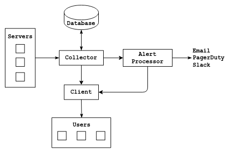

# Nothing（BETA）

Nothing 是一个用 Go 编写的简单的 Linux 系统监控工具。Nothing 主要支持监控小型服务器、家用电脑和树莓派（Raspberry Pi）等设备，现在已扩展成为 Linux 系统级监控程序。Nothing 还支持自定义时间序列数据收集，可用来收集传感器或程序的输入输出和性能数据。

当前，Nothing 以一定时间为间隔，收集以下数据指标：
* 系统信息
* CPU 信息
* 内存/内存回收资源（SWAP）信息
* 一小时前（默认值）或自定义时间区间的CPU/内存使用图表
* 磁盘使用和使用图表
* 网络使用信息和图表
* 服务运行情况
* 系统进程按 CPU 或内存使用率排序
* 自定义指标（时间序列数据）收集和图表
* 在指定的时间或数据区间显示指标数据
* 指定时间加载进程数据
* 设置警报：CPU/内存/内存回收资源（SWAP）/磁盘/服务
  * 通过电子邮件、Slack 或叮叮等工具推送系统警报给用户
* 自定义数据保留周期

### 屏幕截图


## 自定义

组件之间通信（agents、collector、frontend 和 alert processor）是使用 gRPC 来实现。如果需要，可以设置自定义服务来读取数据或将数据推送到任何组件。[API](internal/api/api.proto)、[Alert API](internal/alertapi/alertapi.proto)。

## 组成部分

Nothing 主要有 4 个主要的组件，用户可以使用这些组件来收集指标和处理警报。

[](png/nothing_components.png)

### Agent（代理）

Agent 必须安装到你需要监控的系统中。一旦 Agent 被安装和配置，Agent 将在给定的收集时间间隔内收集和发送指标给 Collector。Agent 也可以向 Collector 发送自定义指标。

自定义指标可以通过 cron 作业或脚本/应用定期收集应用程序、进程数据和传感器数据。

### Collector（收集器）

Collector 是 Nothing 的一个必要组件。Collector 要求 MariaDB 版本 >= 10.5，以便来存储数据。一旦设置好，Collctor 可以从多个服务器收集监控数据。Collector 可以检查警报信息。如果一个警报被提出，状态变更或 Resolved，Collector 将推送 Alert 到 Alert processor（警报处理器）。默认情况下，收集的监控数据将在每 60 天清除一次。这些参数可在配置文件中进行修改。

### Alert Processor（警报处理器）

Alert Processor 是 Nothing 的一个可选组件。如果你只想收集、可视化指标和自定义数据，那么你可以忽略这个组件。但是，如果你希望设置警报，那么你可以使用 Alert Processor 将传入的警报或警报状态推送给电子邮件、PagerDuty 或 Slack。Nothig 的 UI 元素，也就是客户端组件也使用 Alert processor 来获取发出的警报。

### Client（客户端）

Client 组件是 Nothing 的用户界面组件，可以通过浏览器访问。Client 需要从 Collector 请求数据，并以图形或表格形式显示数据。Client 可以查看服务器是否活跃，以及与 Collector 的连接情况。

Client 组件可以用图形或表格显示所有收集到的数据，其中包括 Agents 推送的自定义指标数据。目前，Client 不需要任何用户认证、但可以使用 Apache 或 Nginx 等代理服务器配置认证和 HTTPS 服务。如果在公网使用，建议使用这种做法。

## 安装和使用

### 支持传输层安全（TLS）

Agent、Collector、Alert processor 和 Client 之间通信可以使用 TLS 进行加密。可以在各自的 config.json 配置文件中指定服务器证书、服务器私钥（Collector、Alert processor）和 CA 文件（Agents、Collector、Client）。

如果使用 TLS，Collector 和 Alert processor 需要服务器证书和私钥。Agents 和 Clients 需要 CA 文件来与它们通信。

如果与 Alert processor 使用 TLS，Collector 也需要 alert processor 的服务器证书的 CA 文件，以便将 alert 推送到 processor。

Client 和终端用户之间的通信应该使用 Apache/Nginx 等代理服务器进行 加密。

### Collector

第一步是安装 `MariaDB`（版本 >= 10.15）并创建一个数据库。一旦设置好，可以在`config.json` 文件配置必要参数，其中包括数据库名称、用户和主机等信息。`.env` 文件应该用来设置数据库密码。`alert.json` 文件用来设置警报规则。如果不打算使用警报，那么可以忽略警报规则选项。

一旦所有都设置好了，你可以运行以下命令来初始化 Collector。这将创建数据库表并生成密钥（key）文件：

```
./collector_linux_86_64 --init --config=config.json
```

初始化完成后。你可以用以下命令运行 collector。`--alerts` 参数是可选的，可将 collector 作为一个服务。相关例子可以从[这里]()找到。

```
./collector_linux_x86_64 --config=config.json --alerts=alerts.json
```

### Agents

你应该首先安装 Collector、初始化，并把密钥文件拷贝到服务器上，以安装 Agent。

一旦密钥文件和可执行文件在同一的目录下，并在 `config.json` 文件中配置好。你就可以运行以下命令将 agent 注册到 Collector。

```
./agent_linux_x86_64 --init
```

初始化后，运行 Agent（最好是作为一个服务）去启用指标收集。

### Custom metrics（自定义指标）

自定义时间序列数据可以使用 agent 添加。如下所示，当前的服务时间将被作为 time。运行以下带有参数的命令将把数据发送到 Collector。这也可以手动完成，使用一个 cron 作业，或通过一个应用程序。

```
./agent_linux_x86_64 --custom --name=test --unit=byte --value=1.0

./agent_linux_x86_64 --custom --name='active-http-requests' --unix='requests' --value=$(netstat | grep -c https)
```

### Alerts

这是 Nothing 的可用选项。如果你需要处理警报并将其推送到电子邮件、Slack 或叮叮，那么可以启用 Alerts。

在 `config.json` 和 `.env` 配置文件中填入 Slack、叮叮的配置和 API 凭证，然后运行 Alert processor。

```
./alertprocessor_linux_x86_64
```

### Clients

要运行 Client，你需要填写 `config.json` 配置文件并运行以下命令来启用。如果需要，你可以使用 Apache 或 Nginx 等代理服务器来设置 SSL 和用户认证。

```
./client_linux_x86_64
```

### API 文档

Client 开放了 REST API 接口来检索数据集合。

#### 端点

* `/system`
    * 返回系统信息
* `/memory`
    * 返回内存信息/使用情况
* `/swap`
    * 返回内存回收资源（Swap）信息/使用情况
* `/disks`
    * 返回每个磁盘的信息/使用情况
* `/network`
    * 返回每个借口的磁盘信息/使用情况
* `/processes`
    * 返回使用最高的 CPU/RAM 进程列表
* `/processor-usage-historical`
    * CPU 加载 avg
* `/memory-historical`
    * 内存使用情况
* `/services`
    * Agent 的 `config.json` 启用监控的服务列表
* `/custom-metric-names`
    * 自定义指标的名称
* `/custom?custom-metric=name`
    * 自定义指标的值
* GET 请求必要参数
    * 服务的 `serverId=ID`
* GET 请求可选参数
    * 在给定时区间的 `from=[unix timestamp]&to=[unix timestamp] 值
    * 在某个时间的 `time=[unix timestamp]` 值（依赖于有效时间内）

## LICENSE

MIT